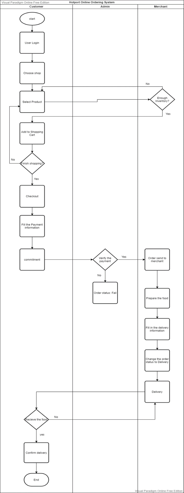
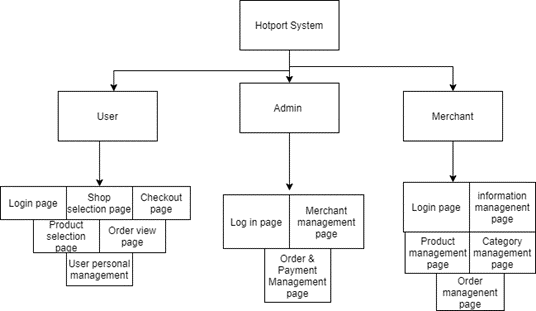
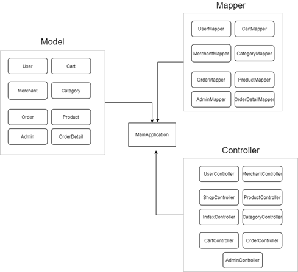
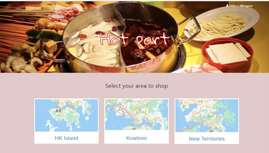

# Hotpot-Delivery
Member : Youran, Yui Sum, Yachen, Anruo, Ziyu, Liu Wei

## Introduction
With the spread of Covid-19, more people are concerned about going to the food market to buy daily needs. Besides, the Hong Kong government had implemented some policy that more than four people are not allowed to eat together in the restaurants, and some restaurants
or bars are not allowed to open at midnight.

Our group proposed a solution to build a hot-pot ingredient purchasing integrated platform: Hotport, which links shops and consumers and help customers to buy ingredients or semi-finished products for hot pot. The shops available on our platform contain hot pot ingredient providers in food markets, and some hot pot restaurants who want to sell their in-stock food.
Customers can order on the platform, then we will match their needs to the food providers.

## System Structure 
The system developed using Java Spring Boot framework as an Backend and BootStrap as frontend. Inside the system, it contains three parties: Users ( Buyer ), Merchant and Admin.

{ height=200px }
{ width=400px }
{ width=400px }

## Demo

